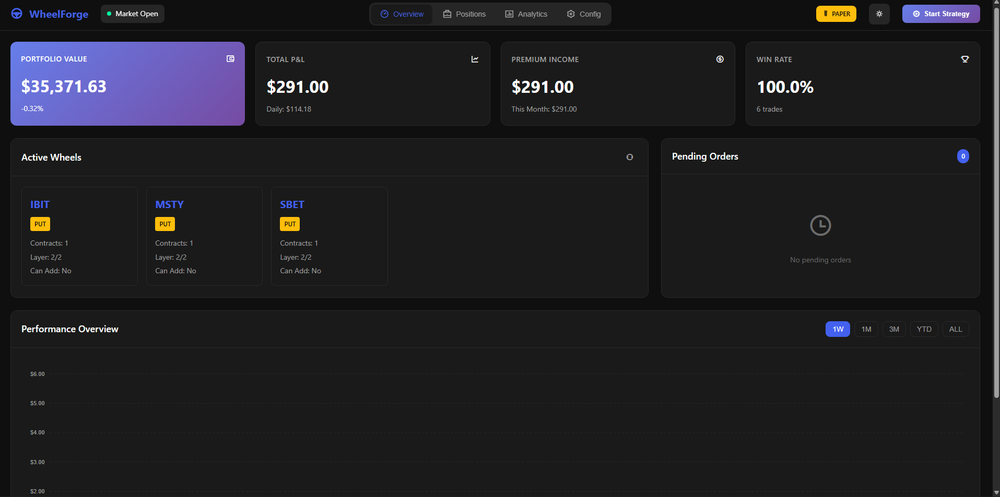
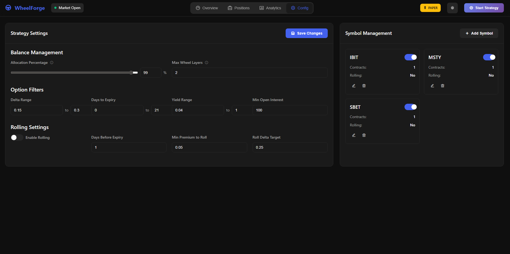
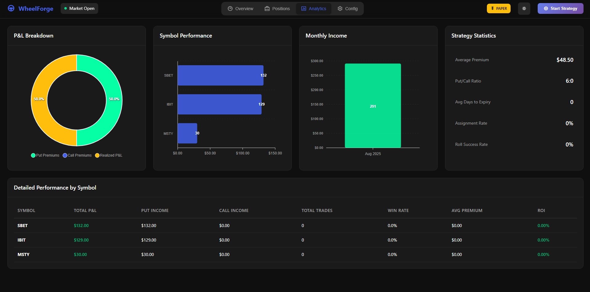
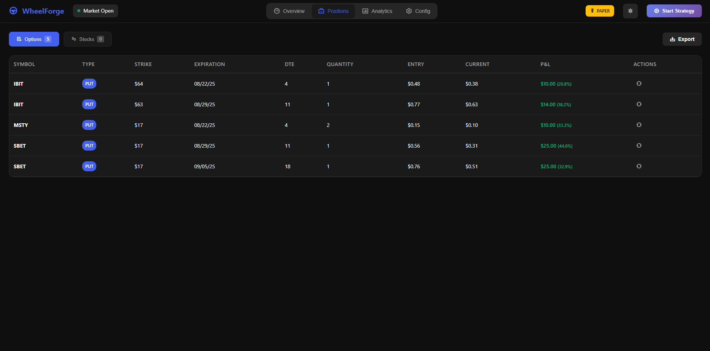

# WheelForge - Automated Options Wheel Strategy

<div align="center">
  


**An enterprise-grade automated trading system with modern web dashboard**  
*Implementing the options wheel strategy with advanced position management, automatic rolling, and intelligent risk controls*

[](https://www.python.org/)
[](https://alpaca.markets/)
[](LICENSE)
[](http://localhost:5000)

</div>

---

## 🚀 Quick Start in 3 Minutes

```bash
# 1. Clone and enter directory
git clone https://github.com/yourusername/wheelforge.git && cd wheelforge

# 2. Install with one command
pip install uv && uv venv && uv pip install -e . && uv pip install -r requirements_web.txt

# 3. Launch the dashboard
python web_app.py

# 4. Open http://localhost:5000 - The setup wizard will guide you through everything!
```

**That's it!** The web interface will walk you through:
- 🔑 Entering your Alpaca API keys
- ⚙️ Configuring your strategy settings  
- 📊 Selecting symbols to trade
- ✅ Starting your first wheel strategy

---

## 🎯 What is WheelForge?

WheelForge is a production-ready automated trading platform that executes the options wheel strategy using the Alpaca Trading API. Built with reliability and profitability in mind, it features enterprise-grade error handling, intelligent position management, and sophisticated risk controls that go beyond basic wheel implementations.

### The Wheel Strategy Enhanced

The classic wheel strategy involves:
1. Selling cash-secured puts to collect premium
2. Taking assignment of shares if ITM at expiration
3. Selling covered calls on assigned shares
4. Repeating the cycle when shares are called away

**WheelForge takes this further with:**
- **Multi-layer positioning** for averaging down opportunities
- **Premium-adjusted cost basis tracking** for optimal strike selection
- **Automatic option rolling** to manage positions before expiration
- **Per-symbol configuration** for tailored risk management
- **Enterprise reliability** with retry logic, circuit breakers, and thread safety

## ⚡ Key Features

### Core Capabilities
- ✅ **Intelligent Option Selection** - Advanced scoring algorithm balancing return vs assignment risk
- ✅ **Multi-Layer Wheels** - Run multiple wheel cycles per symbol for dollar-cost averaging
- ✅ **Cost Basis Optimization** - Tracks premiums to adjust cost basis for better exits
- ✅ **Automatic Rolling** - Roll positions before expiration with configurable strategies
- ✅ **Limit Order System** - Smart order management with automatic repricing for better fills
- ✅ **Database Tracking** - SQLite database for all trades, premiums, and performance metrics
- ✅ **Per-Symbol Configuration** - Customize contracts and settings for each ticker
- ✅ **Modern Web Dashboard** - Real-time monitoring with dark/light mode and live config editing

### Reliability & Safety
- 🔒 **Thread-Safe Operations** - Prevents race conditions with proper locking
- 🔄 **Automatic Retry Logic** - Exponential backoff with circuit breaker pattern
- 💾 **Database Resilience** - WAL mode, connection pooling, transaction management
- 📊 **Comprehensive Monitoring** - Detailed logging and performance tracking
- ⚠️ **API Validation** - Validates all broker responses for completeness
- 🌐 **WebSocket Updates** - Real-time position and order tracking via dashboard

## 🚀 Quick Start

### 1. Installation

```bash
git clone https://github.com/yourusername/wheelforge.git
cd wheelforge
uv venv
source .venv/bin/activate  # Or `.venv\Scripts\activate` on Windows
uv pip install -e .

# For web dashboard (optional but recommended)
uv pip install -r requirements_web.txt
```

### 2. Configuration

Create `.env` for API credentials:
```env
ALPACA_API_KEY=your_key
ALPACA_SECRET_KEY=your_secret
IS_PAPER=true  # Start with paper trading
```

Configure strategy using one of these methods:

#### Option A: Web Dashboard (Recommended)
```bash
# Start the dashboard
python web_app.py
# Or use: start_dashboard.bat (Windows) / ./start_dashboard.sh (Mac/Linux)

# Open http://localhost:5000 in your browser
# Navigate to Config tab to edit all settings
```

#### Option B: Interactive CLI Manager
```bash
python scripts/config_manager.py
```

#### Option C: Direct JSON Edit
Edit `config/strategy_config.json` manually

### 3. Run WheelForge

#### Market Orders (Original)
First run (clean slate):
```bash
run-strategy --fresh-start
```

Regular operation:
```bash
run-strategy
```

With full logging:
```bash
run-strategy --strat-log --log-level DEBUG --log-to-file
```

#### Limit Orders (Recommended for Better Fills)
Run continuously during market hours:
```bash
run-strategy-limit
```

Test with one cycle:
```bash
run-strategy-limit --once
```

Custom settings:
```bash
run-strategy-limit --update-interval 30 --cycle-interval 600
```

### 4. Monitor with Dashboard

Open the web dashboard for real-time monitoring:
```bash
# Start dashboard
python web_app.py

# Open browser to http://localhost:5000
```

## 📈 Advanced Configuration

### Balance & Risk Management
```json
{
  "balance_settings": {
    "allocation_percentage": 0.5,  // Use 50% of account
    "max_wheel_layers": 2          // Layers per symbol
  }
}
```

### Option Filters
```json
{
  "option_filters": {
    "delta_min": 0.15,
    "delta_max": 0.30,
    "expiration_min_days": 0,
    "expiration_max_days": 21,
    "open_interest_min": 100
  }
}
```

### Automatic Rolling (New!)
```json
{
  "rolling_settings": {
    "enabled": true,
    "days_before_expiry": 1,
    "min_premium_to_roll": 0.05,
    "roll_delta_target": 0.25
  }
}
```

### Per-Symbol Configuration
```json
{
  "symbols": {
    "AAPL": {
      "enabled": true,
      "contracts": 1,
      "rolling": {
        "enabled": true,
        "strategy": "forward"  // forward, down, or both
      }
    }
  }
}
```

## 🔧 Core Components

### Strategy Engine (`core/strategy.py`)
Implements the scoring algorithm:
```
score = (1 - |Δ|) × (250 / (DTE + 5)) × (bid_price / strike_price)
```
Balancing annualized return with assignment probability.

### Position Management (`core/state_manager.py`)
Tracks wheel states:
- `short_put` → Assignment → `long_shares`
- `long_shares` → Covered call → `short_call`
- `short_call` → Assignment/Expiry → Repeat

### Database System (`core/database.py`)
- Premium tracking and analysis
- Cost basis adjustments
- Position history
- Performance metrics

### Execution Engine (`core/execution.py` & `core/execution_limit.py`)
- Thread-safe trade execution
- Choice of market or limit orders
- Automatic retry with backoff
- Circuit breaker protection
- Transaction logging

### Order Management (`core/order_manager.py`)
- Tracks pending limit orders
- Automatic price adjustments
- Progressive repricing logic
- Order lifecycle management

## 📊 Monitoring & Analytics

### Modern Web Dashboard
Access comprehensive real-time monitoring at `http://localhost:5000`

#### Dashboard Features
- **📈 Overview Tab**: Key metrics, active wheels, performance charts
- **💼 Positions Tab**: Live options and stock positions with P&L tracking
- **📊 Analytics Tab**: Advanced charts, symbol performance, monthly income
- **⚙️ Config Tab**: Edit all strategy settings without restarting

#### Dashboard Capabilities
- 🌓 **Dark/Light Mode**: Toggle between themes for comfortable viewing
- 🔄 **Real-Time Updates**: WebSocket connection for instant data refresh
- 📱 **Responsive Design**: Works on desktop, tablet, and mobile
- 💾 **Live Config Editing**: Change settings and save directly from browser
- 📈 **Interactive Charts**: Performance tracking with ApexCharts
- 🔔 **Notifications**: Real-time alerts for trades and events
- 📊 **Export Data**: Download positions and performance data

### Database Viewer (CLI)
```bash
# Overall performance summary
python scripts/db_viewer.py --summary

# Cost basis with premium adjustments
python scripts/db_viewer.py --cost-basis

# Symbol-specific analysis
python scripts/db_viewer.py --symbol AAPL --all

# Premium collection history
python scripts/db_viewer.py --premiums --days 60
```

### Strategy Logs
- **Runtime logs**: Console/file output for monitoring
- **Strategy JSON logs**: Detailed trade analysis in `strategy_logging/`
- **Web Dashboard logs**: Real-time event streaming via WebSocket

## 🤖 Automation

### Market Orders (run-strategy)
Best for scheduled execution at specific times:

#### Linux/Mac Cron Setup
```cron
# Run at market open, midday, and before close
0 10 * * 1-5 /path/to/run-strategy >> /logs/morning.log 2>&1
0 13 * * 1-5 /path/to/run-strategy >> /logs/midday.log 2>&1
30 15 * * 1-5 /path/to/run-strategy >> /logs/closing.log 2>&1
```

#### Windows Task Scheduler
Create scheduled tasks to run `run-strategy.exe` at desired intervals.

### Limit Orders (run-strategy-limit)
Best for continuous operation during market hours:

#### Linux/Mac
```bash
# Run as a service or in screen/tmux
screen -S wheelforge
run-strategy-limit
# Detach with Ctrl+A, D
```

#### Windows
```powershell
# Run in background
Start-Process run-strategy-limit -WindowStyle Hidden
```

### Choosing Between Market and Limit Orders
- **Market Orders**: Simple, immediate execution, good for scheduled runs
- **Limit Orders**: Better prices, requires continuous monitoring, saves on spreads

## 🧪 Testing & Validation

Comprehensive test suite included:
```bash
# Run all tests
python tests/test_error_handling.py
python tests/test_database.py
python tests/test_strategy_logic.py
python tests/test_risk_management.py
```

## 💡 Unique Enhancements

### Premium-Adjusted Cost Basis
WheelForge automatically adjusts your cost basis based on collected premiums:
- Buy shares at $100 (from put assignment)
- Sell covered call for $2 → Adjusted basis: $98
- System targets strikes ≥ $98 for improved exit probability

### Multi-Layer Wheel Management
Run multiple wheel cycles simultaneously:
- Layer 1: Initial put → shares → covered call
- Layer 2: New put while holding Layer 1 shares
- Enables averaging down in volatile markets

### Intelligent Rolling Strategies
Three rolling approaches available:
- **Forward Roll**: Same/higher strike, later expiration
- **Down Roll**: Lower strike for better assignment odds
- **Adaptive**: Best option based on scoring algorithm

### Smart Limit Order System
Avoid paying the full bid-ask spread with intelligent order management:
- **Initial Pricing**: Orders start at bid-ask midpoint for optimal fills
- **Automatic Repricing**: Unfilled orders reprice every 20 seconds (configurable)
- **Progressive Strategy**: Each reprice becomes slightly more aggressive
- **Order Expiration**: Auto-cancels after 60 seconds if unfilled
- **Market Hours Operation**: Runs continuously during trading hours

## 🛡️ Production Considerations

### Before Live Trading
1. ✅ Paper trade for 2-4 weeks minimum
2. ✅ Start with conservative settings (30% allocation, 0.20+ delta)
3. ✅ Monitor closely for first week of live trading
4. ✅ Review all risk settings in configuration
5. ✅ Understand options risks and mechanics

### Safety Features
- Automatic position size limits
- Per-symbol contract controls
- Maximum wheel layer restrictions
- Minimum liquidity requirements
- Comprehensive error recovery

## 📚 Documentation

### Essential Commands Reference

#### Market Order Strategy
```bash
run-strategy [options]
  --fresh-start        # Liquidate all positions first
  --strat-log         # Enable JSON strategy logging
  --log-level LEVEL   # DEBUG, INFO, WARNING, ERROR
  --log-to-file       # Save logs to file
```

#### Limit Order Strategy
```bash
run-strategy-limit [options]
  --update-interval SECS  # Order repricing interval (default: 20)
  --cycle-interval SECS   # Strategy cycle interval (default: 60)
  --max-order-age MINS    # Max order age before cancel (default: 1)
  --once                  # Run one cycle then exit
  --strat-log            # Enable JSON strategy logging
  --log-level LEVEL      # DEBUG, INFO, WARNING, ERROR
  --log-to-file          # Save logs to file
```


### Configuration Guide
Use the interactive configuration manager:
```bash
python scripts/config_manager.py
```

### API Documentation
Built on [Alpaca Trading API](https://docs.alpaca.markets/)

## 🎯 Performance Tracking

WheelForge includes comprehensive performance tracking:
- Total premiums collected
- Win/loss ratios
- Cost basis adjustments
- Position history
- Tax reporting data

All stored in local SQLite database for analysis and reporting.

## 🚦 System Status

Monitor system health with built-in diagnostics:
- API connection status
- Circuit breaker states
- Retry attempt counts
- Thread pool utilization
- Database lock statistics

## 🖥️ Web Dashboard Guide

### Screenshots

<div align="center">

#### Dashboard Overview - Main Page

*Real-time portfolio metrics, active wheels, performance tracking, and pending orders*

#### Configuration Editor

*Edit strategy settings, manage symbols, adjust filters and parameters without restarting*

#### Analytics & Performance

*Advanced charts showing P&L breakdown, symbol performance, monthly income, and strategy statistics*

#### Positions Management

*Live options and stock positions with real-time P&L tracking and position details*

</div>

### Starting the Dashboard

#### Windows
```bash
# Double-click start_dashboard.bat
# Or run:
python web_app.py
```

#### Mac/Linux
```bash
# Make script executable (first time only)
chmod +x start_dashboard.sh
./start_dashboard.sh
# Or run:
python web_app.py
```

### Dashboard Navigation

#### Overview Section
- **Portfolio Metrics**: Total value, daily P&L, premium income, win rate
- **Active Wheels Grid**: Visual representation of all active positions
- **Pending Orders**: Live tracking with age progress bars
- **Performance Chart**: Interactive chart with period selection (1W, 1M, 3M, YTD, ALL)

#### Positions Section
- **Options Table**: All option positions with real-time P&L
- **Stocks Table**: Share positions with state tracking
- **Export Function**: Download positions data as CSV

#### Analytics Section
- **P&L Breakdown**: Donut chart showing income sources
- **Symbol Performance**: Bar chart comparing symbol profitability
- **Monthly Income**: Track premium collection trends
- **Strategy Statistics**: Key metrics like average premium, put/call ratio, assignment rate

#### Configuration Section
- **Balance Management**: Adjust allocation percentage with slider
- **Option Filters**: Set delta, DTE, yield ranges
- **Rolling Settings**: Configure automatic rolling parameters
- **Symbol Management**: Add/remove/toggle symbols with contracts

### Using the Dashboard

1. **Start/Stop Strategy**: Use the control button in the top navigation
2. **Toggle Theme**: Click sun/moon icon for dark/light mode
3. **View Market Status**: Green dot = market open, red = closed
4. **Real-Time Updates**: Data refreshes automatically via WebSocket
5. **Save Configuration**: Changes in Config tab save to `strategy_config.json`

## 🔮 Roadmap & Ideas

### Current Development
- [x] ✅ Web dashboard for real-time monitoring (COMPLETED!)
- [ ] Advanced Greeks analysis
- [ ] Volatility-based position sizing
- [ ] Multi-account support
- [ ] Backtesting framework
- [ ] Mobile app companion

### Recent Additions
- ✅ **Modern Dashboard**: Full-featured web interface with dark/light mode
- ✅ **Live Config Editor**: Change settings without restarting
- ✅ **WebSocket Updates**: Real-time position and order tracking
- ✅ **Interactive Charts**: ApexCharts for advanced visualizations
- ✅ **Responsive Design**: Works on all device sizes

### Community Contributions Welcome
- Technical indicators integration
- Alternative scoring algorithms
- Risk management enhancements
- Performance optimizations
- Dashboard theme customization

## ⚠️ Risk Disclosure

Options trading involves substantial risk and is not suitable for all investors. Please read [Characteristics and Risks of Standardized Options](https://www.theocc.com/company-information/documents-and-archives/options-disclosure-document) before trading.

This software is provided as-is for educational purposes. Past performance does not guarantee future results. Always understand the risks before trading with real capital.

## 📄 License

This project is a fork of the [Alpaca options-wheel](https://github.com/alpacahq/options-wheel) implementation, significantly enhanced with:
- Production-ready error handling and recovery
- Advanced position management with multi-layer wheels
- Automatic option rolling capabilities
- Premium-adjusted cost basis tracking
- Enterprise-grade reliability features

The original codebase and this fork are provided for educational purposes. Please ensure you understand all risks before using this software for live trading.

### Contributing

Contributions are welcome! Please feel free to submit pull requests, report bugs, or suggest new features through the GitHub issues page.

### Acknowledgments

- Original implementation by [Alpaca Markets](https://alpaca.markets/)
- Enhanced and maintained by the WheelForge community

---

**WheelForge** - Forging profitable wheels in the options market 🛞⚙️

*Built with precision. Runs with confidence. Trades with intelligence.*